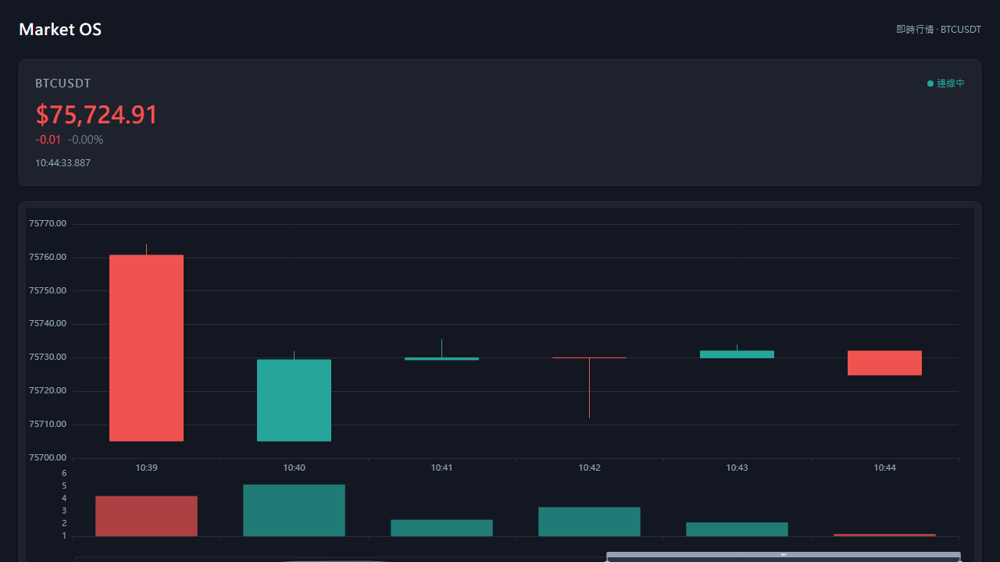

# Market OS

即時市場資料研究平台。從 Binance WebSocket 接收 BTCUSDT 成交資料，透過 MongoDB 儲存、Redis Pub/Sub 傳遞，以 Vue 3 + ECharts 即時呈現 K 線圖與價格卡片。



---

## 快速啟動

```bash
git clone https://github.com/tizza14/market-os.git
cd market-os
docker compose up -d
```

等待約 30 秒，所有服務健康啟動後訪問 **http://localhost:5173**。

---

## 系統架構

```
Binance WebSocket
       ↓
market-data-service  →  MongoDB (market_ticks, klines)
                     →  Redis Pub/Sub (market:btcusdt)
                              ↓
                       api-gateway  →  REST API (/api/*)
                                    →  WebSocket (/ws/market)
                                              ↓
                                         frontend (Vue 3)
```

| 服務 | 職責 |
|---|---|
| `market-data-service` | Binance WS 連線、Tick 解析、K 線聚合、MongoDB 寫入、Redis 發布 |
| `api-gateway` | Redis 訂閱、WebSocket 廣播、REST API |
| `frontend` | 即時 K 線圖、價格卡片、WebSocket 接收 |
| `mongo` | Tick 及 K 線持久化儲存 |
| `redis` | 服務間即時資料傳遞 |

---

## 技術棧

| 層級 | 技術 |
|---|---|
| Frontend | Vue 3、TypeScript、Pinia、ECharts 5、TailwindCSS 3、Vite |
| Backend | Node.js 20、Fastify 5、TypeScript、Zod |
| 資料庫 | MongoDB 7（Decimal128 精度儲存） |
| 訊息佇列 | Redis 7 Pub/Sub |
| 容器化 | Docker Compose、Nginx |
| Monorepo | npm workspaces |
| 測試 | Vitest（42 tests） |

---

## REST API

### `GET /api/health`

```json
{
  "status": "ok",
  "timestamp": 1748131200000,
  "services": { "mongo": "connected", "redis": "connected" }
}
```

### `GET /api/market/latest`

回傳最新一筆成交資料。

```json
{
  "symbol": "BTCUSDT",
  "price": "104523.45",
  "quantity": "0.00123456",
  "eventTime": 1748131200000
}
```

### `GET /api/market/klines?limit=100&symbol=BTCUSDT&interval=1m`

回傳 K 線陣列（最多 500 筆，按 openTime 升序）。

```json
{
  "symbol": "BTCUSDT",
  "interval": "1m",
  "data": [
    {
      "openTime": 1748131200000,
      "closeTime": 1748131259999,
      "open": "104000.00",
      "high": "104523.45",
      "low": "103800.00",
      "close": "104200.00",
      "volume": "12.34567890",
      "tradeCount": 145
    }
  ]
}
```

### `WebSocket /ws/market`

連線後持續接收即時成交事件：

```json
{
  "type": "market:update",
  "data": {
    "symbol": "BTCUSDT",
    "price": "104523.45",
    "quantity": "0.00123456",
    "isBuyerMaker": false,
    "eventTime": 1748131200000
  }
}
```

---

## 專案結構

```
market-os/
├── apps/
│   ├── frontend/               # Vue 3 + ECharts 儀表板
│   │   ├── src/
│   │   │   ├── api/            # REST client
│   │   │   ├── components/     # PriceCard、KlineChart
│   │   │   ├── services/       # MarketWebSocket（重連 + ping）
│   │   │   ├── stores/         # Pinia store
│   │   │   └── utils/          # priceChange（decimal.js）
│   │   ├── Dockerfile
│   │   └── nginx.conf
│   ├── api-gateway/            # Fastify REST + WebSocket
│   │   └── Dockerfile
│   └── market-data-service/    # Binance WS → MongoDB + Redis
│       └── Dockerfile
├── packages/
│   ├── shared-types/           # 共用 TypeScript 型別
│   └── config/                 # 共用常數（REDIS_CHANNELS、SYMBOLS）
├── docker-compose.yml
└── docs/
    └── market-os-spec.md       # 完整規格文件
```

---

## 開發模式

### 前置需求

- Node.js 20+
- Docker Desktop

### 啟動步驟

```bash
# 1. 安裝依賴
npm install

# 2. 啟動 MongoDB + Redis
docker run -d -p 27017:27017 --name mongo mongo:7
docker run -d -p 6379:6379 --name redis redis:7-alpine

# 3. 啟動後端服務（各自在 apps/ 子目錄執行）
cd apps/market-data-service && npm run dev
cd apps/api-gateway && npm run dev

# 4. 啟動前端
cd apps/frontend && npm run dev
# → http://localhost:5173
```

### 環境變數

`apps/market-data-service/.env`：

```
REDIS_URL=redis://localhost:6379
MONGO_URL=mongodb://localhost:27017/market-os
LOG_LEVEL=info
```

`apps/api-gateway/.env`：

```
REDIS_URL=redis://localhost:6379
MONGO_URL=mongodb://localhost:27017/market-os
PORT=3000
LOG_LEVEL=info
```

---

## 測試

```bash
# 全 workspace 測試
npm test --workspaces

# 個別服務
npm test -w apps/market-data-service   # 26 tests
npm test -w apps/api-gateway           # 11 tests
npm test -w apps/frontend              # 5 tests
```

---

## 資料精度

price 與 quantity 在服務間以 **string** 傳輸，避免 JavaScript 浮點數精度損失。MongoDB 以 **Decimal128** 儲存，前端顯示層才以 `decimal.js` 轉換為可讀格式。

```
傳輸層  → string     "104523.45000000"
儲存層  → Decimal128  Decimal128("104523.45000000")
顯示層  → number      104523.45  (decimal.js → toFixed → toLocaleString)
```

---

## License

MIT
